# OpenBridge Design System SASS implementation

## Files
These are the main files in the sass project:
- `openbridge-*palletname*` root files, compile each of these to get pallet css files.
- `_variables.scss` pallet independent variables.
- `_variables-*palletname*.scss` pallet dependent variables.
- `mixins/` folder with mixins
- `mixins/_styles.scss` mixins of styles and states.
- `components/` folder with definition of components.

# Development
The sass files are compiled to css by using `npm run css` or `npm run watch-css` to compile each time a sass file has changed.
This will also run tests to verify that all variables are used, linting (with autofix) and check of the bundlesize.

## Architecture of styles
The figure below gives an overview of a component should be build:

1. Place all pallet independent parameters in `_variables.scss`. All variables which depend on pallet should be placed in `variables-*palletname*.scss`.
2. Make styles mixins in `mixins/_styles.scss`. The styles could be normal, raised, flat, indent, etc. Each style should also define the states (pseudo-classes) such as normal, hover, focus, active, etc.
3. For some component not only the colors in the style changes, but the chosen style changes. For instance from `normal` in day to `flat` in dusk. For such cases define the pallet depending style in `_config-*palletname*.scss`.
4. Define the component, remember to separate common behaviour in root classes, e.g., `ob-btn`, `ob-raised` and `ob-normal`.

## Pallet files
The base sass files are `openbridge-*palletname*.scss`. 
Note that parameters should be placed in `_variables.scss`.
Variables which are changing with the pallet should be placed in `_variables-*palletname*.scss`, this is for instance colors.
The base sass files (`openbridge-*palletname*.scss`) loads the following files:
1. `_openbridge-base.scss`, its main task is to load global variables and functions which does not depend on the palettes.
2. `_variables-*palletname*.scss`, contains pallet depending variables.
3. `_config-*palletname*.scss`, contains pallet depending functions. Such as deciding the style class of a normal button.
4. `_openbridge-components.scss`, contains the definition of styles for the components. 

## Naming conventions:
- All class names starts with `ob-`, this is to avoid naming conflicts.
- Permutation of classes should be separated in different classes. E.g., `ob-btn ob-raised` and `ob-btn ob-normal`, not `ob-btn-raised`. This is to avoid situations like `ob-btn-large-raised`.
- Style parameters consist of three parts, the style name, the state name and the variable purpose. They should be ordered `$*style name*-*state name*-*variable purpose*`.
    For instance `$style-raised-normal-fill-color`, where `style-raised` is the style, `normal` is the state and `fill-color` is the variable purpose.

## Test driven development
[Quixote](https://github.com/jamesshore/quixote) is used as test framework for css stylesheet. 
Its purpose is to test that the positioning and spacing is correct.
See for instance [Topbarstyle test](../projects/openbridge-components/src/lib/navigation/top-bar/top-bar.component.spec.ts) for an example.

The tests are depending on css files. These can be compiled by running `npm run watch-css`. 
The css-file is made available to karma in the [karma.conf.js-file](../projects/openbridge-components/karma.conf.js).
The test can be runned by running `ng test`.
